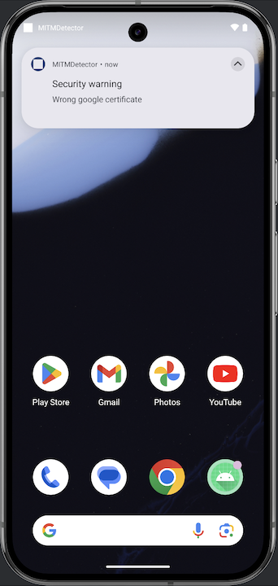
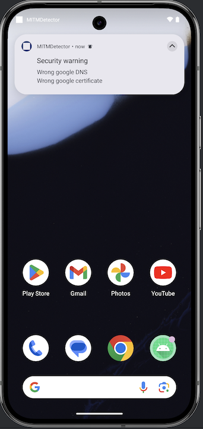

# Project description

🔬 This project is experimental.
🕵️ It is designed to detect some Man-In-The-Middle (MITM) attacks on Android devices.

🛡️ Currently, it is limited to two types of checks:
- **Detecting corrupted DNS responses**: This is achieved by asking the system to resolve a known domain and verifying the response.
- **Detecting HTTPS proxy interception**: This is done by checking the public key of a known website's HTTPS certificate. Malicious users can configure their own proxy and expose their own certificate. Furthermore, it is possible for a malicious user to add this certificate as a trusted certificate on the phone, enabling interception of encrypted HTTPS traffic.

⚡ The detection happens in the background when a new network connection becomes available. This is a limitation because the proxy could be set up later...

📱 The following tests were performed using the emulator integrated into Android Studio.

# Scenario 1: https interception detection
- Start Burp on the host machine (192.168.0.11).
- Configure Burp to listen on port 8080 on all interfaces.
- Change the android virtual device proxy configuration:
```
adb shell settings put global http_proxy 192.168.0.11:8080
```

- Then stop and re-start the wifi connection, in order to trigger the check:
```
adb shell svc wifi enable
adb shell svc wifi disable
```

- A notification is displayed to warn the user:



# Scenario 2: Evil DNS Server detection
- Let's set up a malicious DNS server on the host machine. It will respond with a fake IP to any request.
```
cat <<EOF > named.conf
options {
    directory "/var/cache/bind";
    listen-on port 53 { any; };
    allow-query { any; };
};

zone "." IN {
    type master;
    file "/etc/bind/db.evil";
};
EOF

cat <<EOF > fake.db
\$TTL 3h
@       IN      SOA     fake. root.fake. (
        1         ; Serial
        1d        ; Refresh
        12h       ; Retry
        1w        ; Expire
        3h )      ; Negative Cache TTL
        IN      NS      fake.
*       IN      A       1.1.1.42
EOF

docker run --rm -p 53:53/udp -p 53:53/tcp -v $(pwd)/named.conf:/etc/bind/named.conf -v $(pwd)/fake.db:/etc/bind/db.evil internetsystemsconsortium/bind9:9.18
```

- You need to configure the host machine and/or the Android virtual device to use this DNS server.

- Again, let's stop and re-start the wifi connection, in order to trigger the check:
```
adb shell svc wifi enable
adb shell svc wifi disable
```

- This time, we can see a warning for the DNS check:


